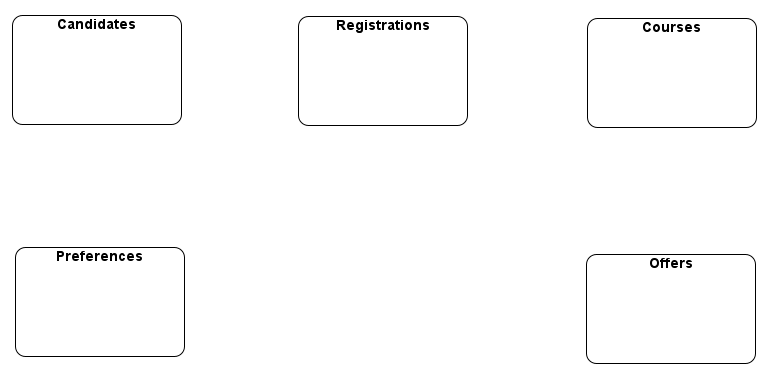
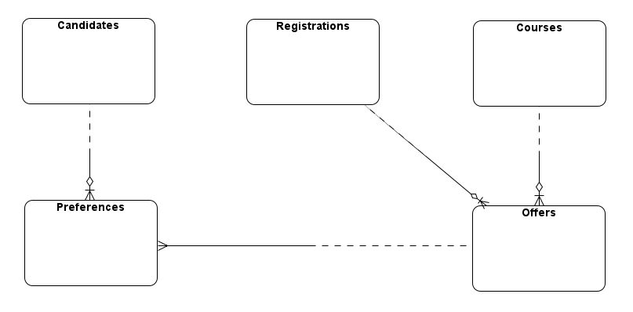
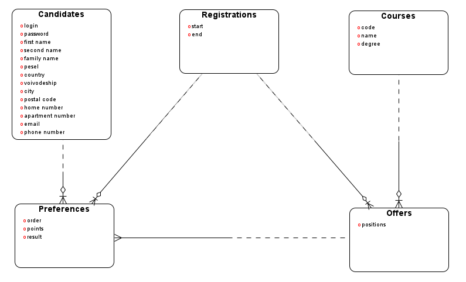
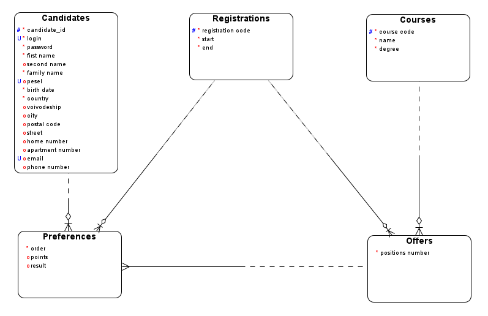
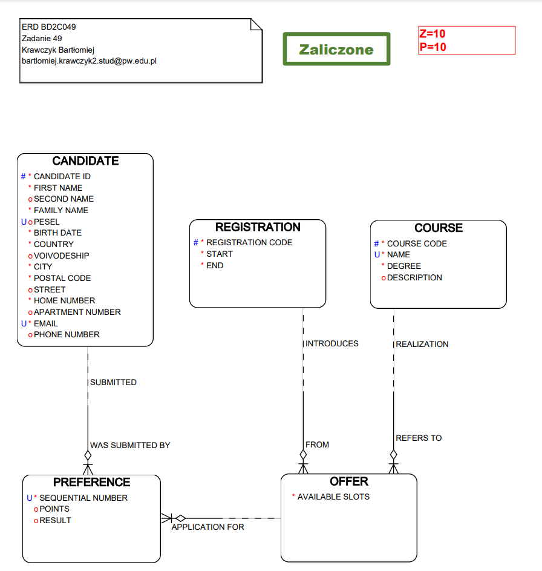
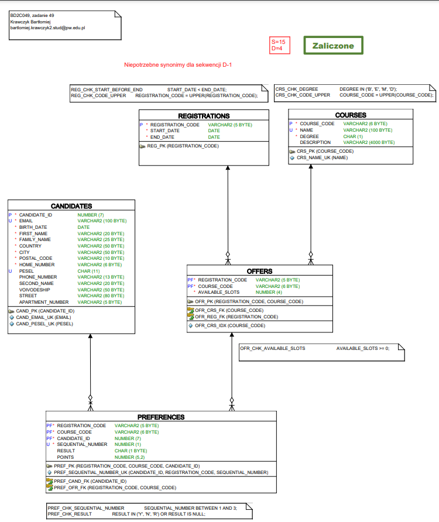

# Zadanie 49

Zadanie należy rozwiązać postępując dokładnie według instrukcji do projektu.

Wyższa uczelnia prowadzi nabór kandydatów na studia. Każdy kandydat rejestruje się podając swoje dane osobowe oraz 3 wybrane kierunki studiów z oferty uczelni (kolejność decyduje o preferencjach). Rekrutacje odbywają się dwa razy w roku, a oferta kierunków zmienia się z czasem. Kandydat, który nie dostał się na studia we wcześniejszych rekrutacjach, może startować w kolejnych.

# Analiza zadania - spostrzeżenia początkowe

Cechy problemu:
- niewielka i dobrze określona ilość typów obiektów
- nie do końca określona liczba właściwości, jednak stała dla każdego kandydata

=> Brak potrzeby użycia struktury generycznej

# Analiza zadania - szukanie encji

## 1. Podkreślamy rzeczowniki i wyrażenia o podobnej roli

`Wyższa uczelnia` prowadzi `nabór` `kandydatów` na `studia`. Każdy `kandydat` rejestruje się podając swoje `dane osobowe` oraz 3 wybrane `kierunki studiów` z `oferty uczelni` (`kolejność` decyduje o `preferencjach`). `Rekrutacje` odbywają się dwa razy w `roku`, a `oferta kierunków` zmienia się z `czasem`. `Kandydat`, który nie dostał się na `studia` we wcześniejszych `rekrutacjach`, może startować w kolejnych.

## 2. Eliminujemy powtórzenia

Pierwsze wystąpienia rzeczowników w kolejności:
- wyższa uczelnia
- nabór
- kandydaci
- studia
- dane osobowe
- kierunki studiów
- oferta uczelni / kierunków
- kolejność
- preferencje
- rekrutacja
- rok
- czas

`Wyższa uczelnia` prowadzi `nabór` `kandydatów` na `studia`. Każdy kandydat rejestruje się podając swoje `dane osobowe` oraz 3 wybrane `kierunki studiów` z `oferty uczelni` (`kolejność` decyduje o `preferencjach`). `Rekrutacje` odbywają się dwa razy w `roku`, a oferta kierunków zmienia się z `czasem`. Kandydat, który nie dostał się na studia we wcześniejszych rekrutacjach, może startować w kolejnych.


## 3. Eliminujemy określenia dotyczące całości, występujące jednostkowo

Wyższa uczelnia prowadzi nabór `kandydatów` na studia. Każdy kandydat rejestruje się podając swoje `dane osobowe` oraz 3 wybrane `kierunki studiów` z `oferty uczelni` (`kolejność` decyduje o `preferencjach`). `Rekrutacje` odbywają się dwa razy w `roku`, a oferta kierunków zmienia się z `czasem`. Kandydat, który nie dostał się na studia we wcześniejszych rekrutacjach, może startować w kolejnych.

## 4. Eliminujemy określenia pomocnicze

Wyższa uczelnia prowadzi nabór `kandydatów` na studia. Każdy kandydat rejestruje się podając swoje `dane osobowe` oraz 3 wybrane `kierunki studiów` z `oferty uczelni` (kolejność decyduje o `preferencjach`). `Rekrutacje` odbywają się dwa razy w `roku`, a oferta kierunków zmienia się z `czasem`. Kandydat, który nie dostał się na studia we wcześniejszych rekrutacjach, może startować w kolejnych.

## 5. Eliminujemy cechy innych obiektów

Wyższa uczelnia prowadzi nabór `kandydatów` na studia. Każdy kandydat rejestruje się podając swoje dane osobowe oraz 3 wybrane `kierunki studiów` z `oferty uczelni` (kolejność decyduje o `preferencjach`). `Rekrutacje` odbywają się dwa razy w roku, a oferta kierunków zmienia się z czasem. Kandydat, który nie dostał się na studia we wcześniejszych rekrutacjach, może startować w kolejnych.

## 6. Scalamy obiekty związane 1 - 1

Wyższa uczelnia prowadzi nabór `kandydatów` na studia. Każdy kandydat rejestruje się podając swoje dane osobowe oraz 3 wybrane `kierunki studiów` z `oferty uczelni` (kolejność decyduje o `preferencjach`). `Rekrutacje` odbywają się dwa razy w roku, a oferta kierunków zmienia się z czasem. Kandydat, który nie dostał się na studia we wcześniejszych rekrutacjach, może startować w kolejnych.

## 7. Wybieramy nazwy kandydatów na encje

- Kandydaci - Candidates
- Kierunki studiów - Courses
- Oferta uczelni - Offers
- Preferencje - Preferences
- Rekrutacje - Recruitments

# ERD - encje



# Analiza zadania - szukanie związków

## 1. Szukamy sformułować wskazujących na powiązania między encjami

Wyższa uczelnia prowadzi nabór kandydatów na studia. `Każdy` kandydat `rejestruje się podając swoje` dane osobowe `oraz 3` `wybrane kierunki` studiów `z` oferty uczelni (`kolejność decyduje o` preferencjach). Rekrutacje odbywają się dwa razy w roku, `a` oferta kierunków `zmienia się z czasem`. Kandydat, `który nie dostał się` na studia we wcześniejszych rekrutacjach, `może startować w kolejnych`.

## 2. Wybieramy opisy kandydatów na związki

- Każdy ... rejestruje się podając swoje ... oraz 3 ... (kandydaci - preferencje)
- wybrane kierunki ... z ... (kierunki - oferty)
- ... kolejność decyduje o ... (oferty - preferencje)
- ... a ... zmienia się z czasem (oferty - rekrutacje)
- który nie dostał się ... może startować w kolejnych (preferencje - rekrutacje) - (po dłuższym zastanowieniu ten związek wynika ze związku `oferty - preferencje`)

preferencje - rekrutacje

# ERD - związki


### Stopień związków:
- Każdy kandydat może mieć do 3 preferencji na rekrutację, ale każda preferencja dotyczy tylko jednego kandydata
    - związek 1 - n
    - kandydaci - preferencje
- Każdy kierunek może wystąpić w ofertach uczelni z kilku rejestracji, w ofercie uczelni na daną rejestrację dostępny może być tylko jeden kierunek
    - związek 1 - n
    - kierunki - oferty
- Każda oferta może zostać wybrana przez kilku kandydatów jednocześnie, jedna preferencja odnosi się do jednej oferty
    - związek 1 - n
    - oferty - preferencje
- W jednej rekrutacje jest dostępnych wiele ofert, dana oferta jest dostępna tylko w jednej rekrutacji
    - związek 1 - n
    - rekrutacje - oferty

**UWAGA:** ten związek wynika ze związku `oferty - preferencje` - można go pominąć:
- W danej rekrutacji wielu kandydatów może złożyć do 3 swoich preferencji, dana preferencja może zostać złożona tylko w jednej rekrutacji
    - związek 1 - n
    - rekrutacje - preferencje


### Opcjonalność związków:
- Preferencja musi dotyczyć kandydata
    - związek po stronie preferencji obowiązkowy
- Preferencja musi dotyczyć oferty
    - związek po stronie preferencji obowiązkowy
- Preferencja musi dotyczyć rekrutacji
    - związek po stronie preferencji obowiązkowy
- Kandydat może być już zarejestrowany, ale może jeszcze nie złożyć żadnej preferencji
    - związek po stronie kandydata opcjonalny
- Encje rekrutacje, Kierunki mają charakter słowników
    - związki po ich stronie muszą być opcjonalne
- W ramach oferty musi być przypisany pewien kierunek
    - związek po stronie oferty obowiązkowy
- Oferta musi występować w ramach rekrutacji
    - związek po stronie oferty obowiązkowy
- Przed otwartą rejestracją na ofertę jeszcze nikt się nie zgłosił
    - związek po stronie oferty opcjonalny

```
kandydaci   - - - ----<     preferencje
rekrutacje  - - - ----<     preferencje -> (rekrutacje -< oferty -< preferencje)
oferty      - - - ----<     preferencje
kierunki    - - - ----<     oferty
rekrutacje  - - - ----<     oferty
```



# Analiza zadania - szukanie atrybutów

## 1. Szukamy sformułowań opisujących cechy encji

Wyższa uczelnia prowadzi nabór kandydatów na studia. Każdy kandydat `rejestruje` się podając swoje `dane osobowe` oraz 3 wybrane kierunki studiów z oferty uczelni (`kolejność` decyduje o preferencjach). Rekrutacje `odbywają się dwa razy w roku`, a oferta kierunków zmienia się z czasem. Kandydat, który nie `dostał się` na studia we wcześniejszych rekrutacjach, może startować w kolejnych.

## 2. Wybieramy opisy kandydatów na atrybuty

Kandydaci:
- login
- hasło
- dane osobowe

Preferencje:
- kolejność
- wynik rekrutacji

Rekrutacje:
- początek
- koniec

## 3. Dodajemy deskryptory - nazwy pozwalające stwierdzić co jest czym

Kandydaci:
- login
- hasło
- imię
- drugie imię
- nazwisko
- pesel
- data urodzenia
- kraj
- województwo
- miasto
- kod pocztowy
- ulica
- numer domu
- numer mieszkania
- numer telefonu
- email

Preferencje:
- kolejność
- wynik
- punkty

Rekrutacje:
- start
- koniec

Oferty:
- ilość miejsc

Kierunki:
- kod
- nazwa
- stopień studiów

## 4. Dodajemy opcjonalne pomocnicze opisy

Jak w `reports/Logical.html`

# ERD - atrybuty



# Konwersacja z Wykładowcą przed oddaniem Etapu I

> Oferta kierunków może się zmieniać w czasie, więc uznałem, że dla każdej
> rejestracji będzie ustalana nowa oferta.

Słusznie.

> Ustaliłem, że w tej sytuacji związek preferencji do rejestracji będzie wynikał
> pośrednio poprzez związek preferencji z ofertą.

Też słusznie. "Naukowo" to można określić tak, że oferta jest rozwiązaniem
związku n-m i następuje "przepięcie" związku z Courses na Offers.

> Zastanawiam się jeszcze, w jaki sposób powinniśmy przechowywać dane takie jak
> login i hasło.

Nic takiego nie ma w zadaniu. W żaden sposób też nie wynika z niego, że kandydat
sam rejestruje swoje dane.

# Model koncepcyjny



# Unikalne identyfikatory

Jak w `reports/Logical.html`

# Atrybuty - typy danych

Jak w `reports/Logical.html`

# Konwersacja z Wykładowcą przed oddaniem Etapu II

> Zastanawiam się, czy teraz po usunięciu pola "preference id", same związki
> identyfikujące mogą stanowić unikalny identyfikator? ("candidate id",
> "registration code", "course code") Dany kandydat w danej rejestracji może
> zarejestrować się tylko raz na dany kierunek.

Ma to sens.

> W celu zapewnienia unikalności liczby pozycyjnej w rejestracji kandydata do
> encji "Preference" dodałem unikalny identyfikator na atrybut "order number"
> oraz atrybuty wynikające ze związków identyfikujących: "candidate id" oraz
> "registration code".

Intencja chyba jest dobra, ale to co Pan napisał jest błędne. To nie jest model
relacyjny i tu żadnych kluczy obcych nie ma, więc nie mogą wchodzić do PUID.

Nazwa "order number" jest niefortunna, bo oznacza zwykle numer zamówienia.
Raczej "sequential number" albo "preference number".

> Czy powinienem  ten atrybut (`order number`) ograniczyć do 3 wartości, aby móc sprawdzać czy liczba jest z
> przedziału np. [1;3]?

Tak właśnie należy zrobić.

> Czy nazwa "available slots" lepiej oddaje nazwę atrybutu, który wcześniej
> występował pod nazwą "positions number"? Sygnalizuje on maksymalną ilość
> miejsc dostępnych w czasie rejestracji na dany kierunek.

Na pewno lepiej.

---

> 1. Czy 100 bajtów jest odpowiednią wielkością aby zapisać nazwę kierunku?

Powinno wystarczyć.

> 2. Zastanawiam, czy stopień studiów - "degree" w encji "course"
> może być liczbą czy lepiej dać CHAR(1).

Obie wersje są OK.

> Mogę także dodać dodatkowy atrybut poza stopniem, który będzie decydował
> o rodzaju (problem tutaj występuje z rozróżnieniem inżynierki od licencjatu).

Przy reprezentacji liczbowej może się przydać.

> 3. Czy dodawać wtórne unikalne identyfikatory na atrybuty "start" oraz "end"
> encji "registration"?

UID nic nie pomoże, bo chodzi o zapobieżenie zakładkom, a tego się UID-em nie zrobi.

> 4. Wiem, że numer domu powinien być trzymany jako wartość
> tekstowa np. "28F". Czy w przypadku numeru mieszkania także mam tak postąpić?

Tak, literki zdarzają się i tu. Wiele tzw. numerów to są tak naprawdę ciągi
znaków, niekoniecznie cyfr.

---

> Czy mogę wymagać od kandydatów posiadania numeru telefonu i adresu mailowego?

Adresu e-mail tak, telefonu niekoniecznie.

> Czy mogę założyć, że te atrybuty będą unikalne dla każdego kandydata?

E-mail tak, telefon zdecydowanie nie. Są jeszcze ludzie używający telefonów
stacjonarnych - domowych. Wiem to na pewno, bo sam do nich należę.

> Zastanawiam się czy nazwę kierunku mogę uznać jako wartość unikalną?
> Wydaje mi się to rozsądne, jednak na PW w przeszłości wystąpiło kilka kierunków
> o nazwie Informatyka.

Już tak nie jest, nowa ustawa na to nie pozwala. Więc można przyjąć unikalność.

# Model Logiczny



# Model Relacyjny

# Zalecenia Projektowe

- Nie powinien istnieć indeks, którego klucz jest początkową częścią klucza innego indeksu.

- W systemach OLTP powinny istnieć indeksy umożliwiające szybkie wyszukiwanie i sortowanie wg wszystkich kluczy głównych i obcych.
    - indeksy unikalne na klucze główne i unikalne (w bazach Oracle są generowane automatycznie)
    - indeksy nieunikalne na klucze obce (o ile klucz obcy nie jest początkowym fragmentem głównego/unikalnego)
    - nie projektujemy indeksów „na wszelki wypadek”

- Ograniczenia integralności realizowane przez DBMS są bezwzględnie konieczne w systemach OLTP.
    - nie dopuszczają do zapisu danych na pewno niepoprawnych
    - odpowiadają regułom obowiązującym w świecie
    - np.
        - unikalność kluczy głównych
        - zgodność wartości kluczy obcych z odpowiednimi kluczami głównymi

- Reguły integralności, które można wymusić deklaratywnie, należy właśnie tak realizować.
    - typowe ograniczenia definiowane w sposób deklaratywny (bez programowania)
        - realizowane w sposób zoptymalizowany
    - zwykle statyczne - dotyczą wszystkich wierszy w tabeli
    - np.
        - klucz główny
        - klucze unikalne
        - klucze obce
        - więzy kontrolne (check constraints)
        - obowiązkowość kolumny (not null)
        - asercje

---

- Projekt działający na wielu różnych DBMS warto wykonywać tylko, gdy jest do tego silna motywacja biznesowa; nie ma ku temu dobrych wskazań technicznych.

- W tabeli podrzędnej klucz obcy na początku klucza głównego – nie wymaga dodatkowego indeksu
- Klasyfikacja sztywna zrealizowana więzami check
- Zmieniona kolejność kolumn: obowiązkowe i o stałej długości najpierw. 
    - PK (obowiązkowe) 
    - obowiązkowe UK
    - obowiązkowe FK
    - obowiązkowe o stałej długości
    - obowiązkowe o zmiennej długości
    - nieobowiązkowe UK
    - nieobowiązkowe FK
    - nieobowiązkowe o stałej długości
    - nieobowiązkowe o zmiennej długości
- Klucz obcy który nie jest na początku głównego ma indeks nieunikalny (każdy osobny)


- klucze obce od słowników/metadanych z reguły nie mają kaskady kasowania

- W zadaniach na projekcie BD2 nie ma problemów wymagających związków 1-1 i łuku, tej reprezentacji podtypów nie należy zatem używać

---

- Interfejsy pomiędzy (pod)systemami należy ustanawiać w oparciu o perspektywy, a nie tabele

- Dane projektowanego (pod)systemu należy umieścić w wydzielonym, chronionym schemacie, a dla zapewnienia użytkownikom bezpiecznego i przezroczystego dostępu do tych danych należy użyć synonimów i perspektyw.

# Od modelu danych do projektu struktur

## Porządkowanie nazw

- Należy dopracować nazwy tabel, kolumn i ograniczeń
- Trzeba usunąć z nazw spacje, znaki narodowe itp.
- Trzeba zmienić nazwy niektórych kolumn, np. kluczy rekurencyjnych
- Warto uporządkować i skrócić nazwy ograniczeń
- [Można zmienić nazwy tabel i kolumn na wielkie litery]

## Dopracowanie/uzupełnienie projektu

- Projekt trzeba dopracować i uzupełnić
- Warto uporządkować kolejność kolumn, np. klucze główne na początek, kolumny opcjonalne na koniec
- Trzeba poprawić kolejność składników w PK i ew. w UK – klucze obce na początek
- Trzeba dodać potrzebne indeksy na FK
- Należy dodać/zweryfikować ON DELETE CASCADE

# Model relacyjny




# Konwersacja po ocenie etapu III

> dostałem -1 pkt za dodanie synonimu na sekwencję.

> Sekwencję dodałem, aby na użytkowniku BD2C049_APP przechodził test wykorzystujący:
```sql
SELECT CAND_ID_SEQ.CURRVAL INTO v_seq FROM DUAL;
```
> Zastanawiam się, czemu takie rozwiązanie jest błędne?

> Wydaje mi się, że wyszukiwanie na sekwencji może być przydatne np.:
> - jak chcemy zarezerwować pewne id do przydzielenia później
> - jak chcemy sprawdzić jakie id zostało przydzielone w ostatnim insercie

Wartości z sekwencji ma podstawiać wyzwalacz lub inna konstrukcja zdefiniowana przez właściciela sekwencji, a nie inny użytkownik, więc synonim jest zbędny.

Dodatkowo, instrukcja jasno wskazuje na stworzenie synonimów jedynie dla tabel i widoków.

\>" może być przydatne"

Generalnie rzecz ujmując dążymy do sytuacji w której użytkownik ma absolutne minimum uprawnień i możliwości dostęp do struktur, jedynie gdy jest taka faktyczne potrzeba.
Oczywiście "wygodniej i przydatniej" z punktu widzenie użytkownika by było mieć absolutnie wszystkie możliwe uprawnienia i dostępy do wszystkiego, nie jest to jednak bezpieczne z inżynierskiego punktu widzenia.

# Wniosek

Jeśli 3 etap jest oceniany przez młodszych prowadzących lepiej nie dodawać konstrukcji zalecanych, chyba że są naprawdę na bardzo wysokim poziomie.

Dodane testy są jedynie za 2pkt - nie trzeba się wysilać tak bardzo jak ja xD