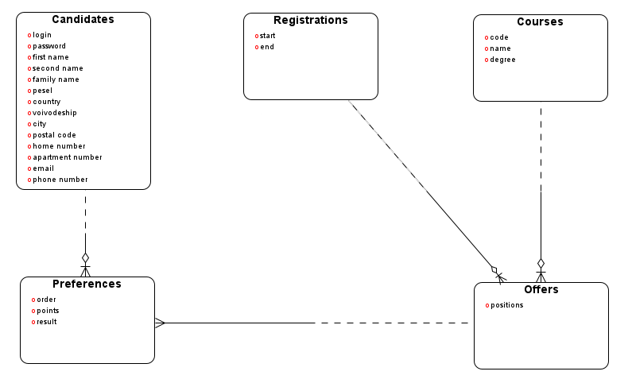
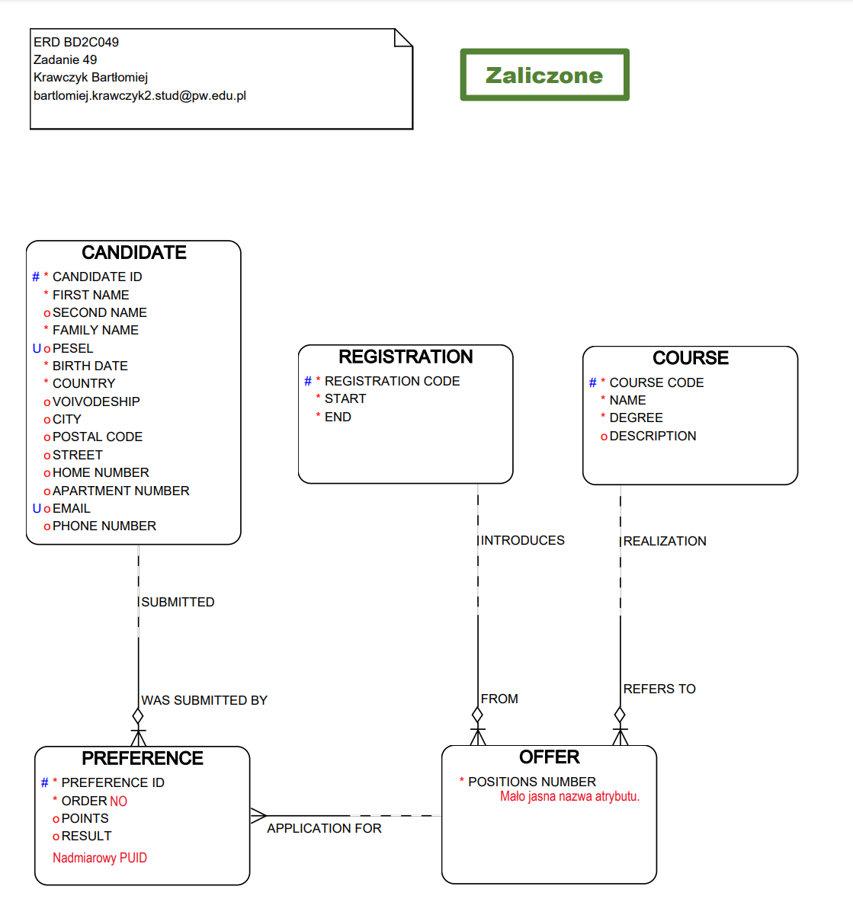

# Zadanie 49

Zadanie należy rozwiązać postępując dokładnie według instrukcji do projektu.

Wyższa uczelnia prowadzi nabór kandydatów na studia. Każdy kandydat rejestruje się podając swoje dane osobowe oraz 3 wybrane kierunki studiów z oferty uczelni (kolejność decyduje o preferencjach). Rekrutacje odbywają się dwa razy w roku, a oferta kierunków zmienia się z czasem. Kandydat, który nie dostał się na studia we wcześniejszych rekrutacjach, może startować w kolejnych.

# Analiza zadania - spostrzeżenia początkowe

Cechy problemu:
- niewielka i dobrze określona ilość typów obiektów
- nie do końca określona liczba właściwości, jednak stała dla każdego kandydata

=> Brak potrzeby użycia struktury generycznej

# Analiza zadania - szukanie encji

## 1. Podkreślamy rzeczowniki i wyrażenia o podobnej roli

`Wyższa uczelnia` prowadzi `nabór` `kandydatów` na `studia`. Każdy `kandydat` rejestruje się podając swoje `dane osobowe` oraz 3 wybrane `kierunki studiów` z `oferty uczelni` (`kolejność` decyduje o `preferencjach`). `Rekrutacje` odbywają się dwa razy w `roku`, a `oferta kierunków` zmienia się z `czasem`. `Kandydat`, który nie dostał się na `studia` we wcześniejszych `rekrutacjach`, może startować w kolejnych.

## 2. Eliminujemy powtórzenia

Pierwsze wystąpienia rzeczowników w kolejności:
- wyższa uczelnia
- nabór
- kandydaci
- studia
- dane osobowe
- kierunki studiów
- oferta uczelni / kierunków
- kolejność
- preferencje
- rekrutacja
- rok
- czas

`Wyższa uczelnia` prowadzi `nabór` `kandydatów` na `studia`. Każdy kandydat rejestruje się podając swoje `dane osobowe` oraz 3 wybrane `kierunki studiów` z `oferty uczelni` (`kolejność` decyduje o `preferencjach`). `Rekrutacje` odbywają się dwa razy w `roku`, a oferta kierunków zmienia się z `czasem`. Kandydat, który nie dostał się na studia we wcześniejszych rekrutacjach, może startować w kolejnych.


## 3. Eliminujemy określenia dotyczące całości, występujące jednostkowo

Wyższa uczelnia prowadzi nabór `kandydatów` na studia. Każdy kandydat rejestruje się podając swoje `dane osobowe` oraz 3 wybrane `kierunki studiów` z `oferty uczelni` (`kolejność` decyduje o `preferencjach`). `Rekrutacje` odbywają się dwa razy w `roku`, a oferta kierunków zmienia się z `czasem`. Kandydat, który nie dostał się na studia we wcześniejszych rekrutacjach, może startować w kolejnych.

## 4. Eliminujemy określenia pomocnicze

Wyższa uczelnia prowadzi nabór `kandydatów` na studia. Każdy kandydat rejestruje się podając swoje `dane osobowe` oraz 3 wybrane `kierunki studiów` z `oferty uczelni` (kolejność decyduje o `preferencjach`). `Rekrutacje` odbywają się dwa razy w `roku`, a oferta kierunków zmienia się z `czasem`. Kandydat, który nie dostał się na studia we wcześniejszych rekrutacjach, może startować w kolejnych.

## 5. Eliminujemy cechy innych obiektów

Wyższa uczelnia prowadzi nabór `kandydatów` na studia. Każdy kandydat rejestruje się podając swoje dane osobowe oraz 3 wybrane `kierunki studiów` z `oferty uczelni` (kolejność decyduje o `preferencjach`). `Rekrutacje` odbywają się dwa razy w roku, a oferta kierunków zmienia się z czasem. Kandydat, który nie dostał się na studia we wcześniejszych rekrutacjach, może startować w kolejnych.

## 6. Scalamy obiekty związane 1 - 1

Wyższa uczelnia prowadzi nabór `kandydatów` na studia. Każdy kandydat rejestruje się podając swoje dane osobowe oraz 3 wybrane `kierunki studiów` z `oferty uczelni` (kolejność decyduje o `preferencjach`). `Rekrutacje` odbywają się dwa razy w roku, a oferta kierunków zmienia się z czasem. Kandydat, który nie dostał się na studia we wcześniejszych rekrutacjach, może startować w kolejnych.

## 7. Wybieramy nazwy kandydatów na encje

- Kandydaci - Candidates
- Kierunki studiów - Courses
- Oferta uczelni - Offers
- Preferencje - Preferences
- Rekrutacje - Recruitments

# ERD - encje


# Analiza zadania - szukanie związków

## 1. Szukamy sformułować wskazujących na powiązania między encjami

Wyższa uczelnia prowadzi nabór kandydatów na studia. `Każdy` kandydat `rejestruje się podając swoje` dane osobowe `oraz 3` `wybrane kierunki` studiów `z` oferty uczelni (`kolejność decyduje o` preferencjach). Rekrutacje odbywają się dwa razy w roku, `a` oferta kierunków `zmienia się z czasem`. Kandydat, `który nie dostał się` na studia we wcześniejszych rekrutacjach, `może startować w kolejnych`.

## 2. Wybieramy opisy kandydatów na związki

- Każdy ... rejestruje się podając swoje ... oraz 3 ... (kandydaci - preferencje)
- wybrane kierunki ... z ... (kierunki - oferty)
- ... kolejność decyduje o ... (oferty - preferencje)
- ... a ... zmienia się z czasem (oferty - rekrutacje)
- który nie dostał się ... może startować w kolejnych (preferencje - rekrutacje) - (po dłuższym zastanowieniu ten związek wynika ze związku `oferty - preferencje`)

preferencje - rekrutacje

# ERD - związki


### Stopień związków:
- Każdy kandydat może mieć do 3 preferencji na rekrutację, ale każda preferencja dotyczy tylko jednego kandydata
    - związek 1 - n
    - kandydaci - preferencje
- Każdy kierunek może wystąpić w ofertach uczelni z kilku rejestracji, w ofercie uczelni na daną rejestrację dostępny może być tylko jeden kierunek
    - związek 1 - n
    - kierunki - oferty
- Każda oferta może zostać wybrana przez kilku kandydatów jednocześnie, jedna preferencja odnosi się do jednej oferty
    - związek 1 - n
    - oferty - preferencje
- W jednej rekrutacje jest dostępnych wiele ofert, dana oferta jest dostępna tylko w jednej rekrutacji
    - związek 1 - n
    - rekrutacje - oferty

**UWAGA:** ten związek wynika ze związku `oferty - preferencje` - można go pominąć:
- W danej rekrutacji wielu kandydatów może złożyć do 3 swoich preferencji, dana preferencja może zostać złożona tylko w jednej rekrutacji
    - związek 1 - n
    - rekrutacje - preferencje


### Opcjonalność związków:
- Preferencja musi dotyczyć kandydata
    - związek po stronie preferencji obowiązkowy
- Preferencja musi dotyczyć oferty
    - związek po stronie preferencji obowiązkowy
- Preferencja musi dotyczyć rekrutacji
    - związek po stronie preferencji obowiązkowy
- Kandydat może być już zarejestrowany, ale może jeszcze nie złożyć żadnej preferencji
    - związek po stronie kandydata opcjonalny
- Encje rekrutacje, Kierunki mają charakter słowników
    - związki po ich stronie muszą być opcjonalne
- W ramach oferty musi być przypisany pewien kierunek
    - związek po stronie oferty obowiązkowy
- Oferta musi występować w ramach rekrutacji
    - związek po stronie oferty obowiązkowy
- Przed otwartą rejestracją na ofertę jeszcze nikt się nie zgłosił
    - związek po stronie oferty opcjonalny

```
kandydaci   - - - ----<     preferencje
rekrutacje  - - - ----<     preferencje
oferty      - - - ----<     preferencje
kierunki    - - - ----<     oferty
rekrutacje  - - - ----<     oferty
```


# Analiza zadania - szukanie atrybutów

## 1. Szukamy sformułowań opisujących cechy encji

Wyższa uczelnia prowadzi nabór kandydatów na studia. Każdy kandydat `rejestruje` się podając swoje `dane osobowe` oraz 3 wybrane kierunki studiów z oferty uczelni (`kolejność` decyduje o preferencjach). Rekrutacje `odbywają się dwa razy w roku`, a oferta kierunków zmienia się z czasem. Kandydat, który nie `dostał się` na studia we wcześniejszych rekrutacjach, może startować w kolejnych.

## 2. Wybieramy opisy kandydatów na atrybuty

Kandydaci:
- login
- hasło
- dane osobowe

Preferencje:
- kolejność
- wynik rekrutacji

Rekrutacje:
- początek
- koniec

## 3. Dodajemy deskryptory - nazwy pozwalające stwierdzić co jest czym

Kandydaci:
- login
- hasło
- imię
- drugie imię
- nazwisko
- pesel
- data urodzenia
- kraj
- województwo
- miasto
- kod pocztowy
- ulica
- numer domu
- numer mieszkania
- numer telefonu
- email

Preferencje:
- kolejność
- wynik
- punkty

Rekrutacje:
- start
- koniec

Oferty:
- ilość miejsc

Kierunki:
- kod
- nazwa
- stopień studiów

## 4. Dodajemy opcjonalne pomocnicze opisy

# ERD - atrybuty



# Model koncepcyjny



# Model logiczny - unikalne identyfikatory

# Unikalne identyfikatory

Jak w `reports/Logical.html`

# Atrybuty - typy danych

Jak w `reports/Logical.html`

# Model Logiczny

